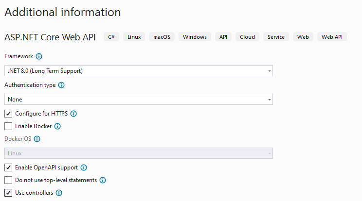
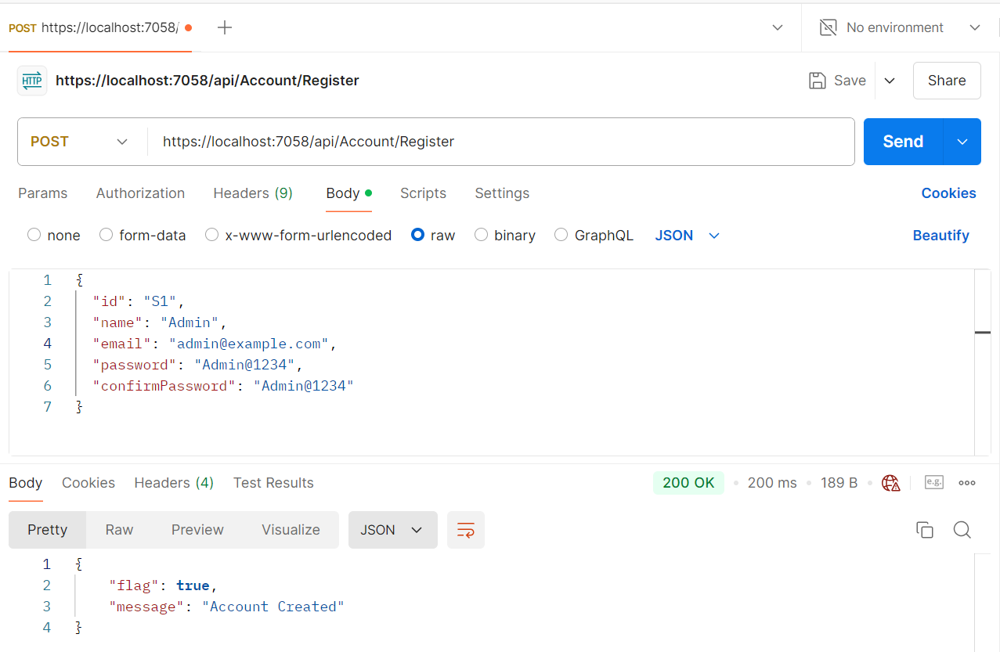
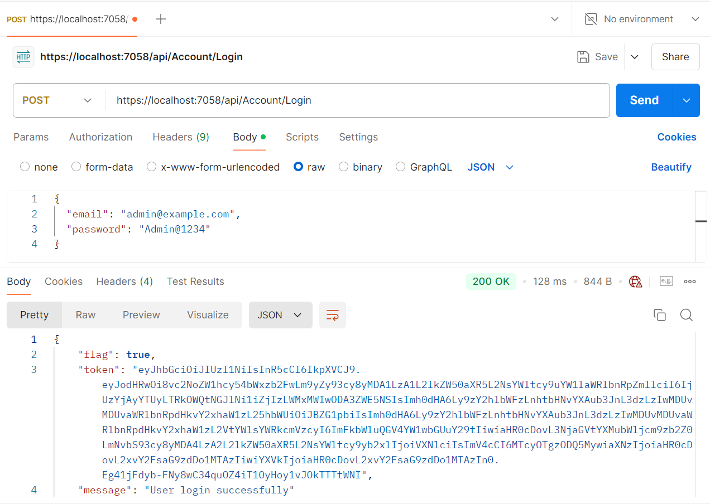
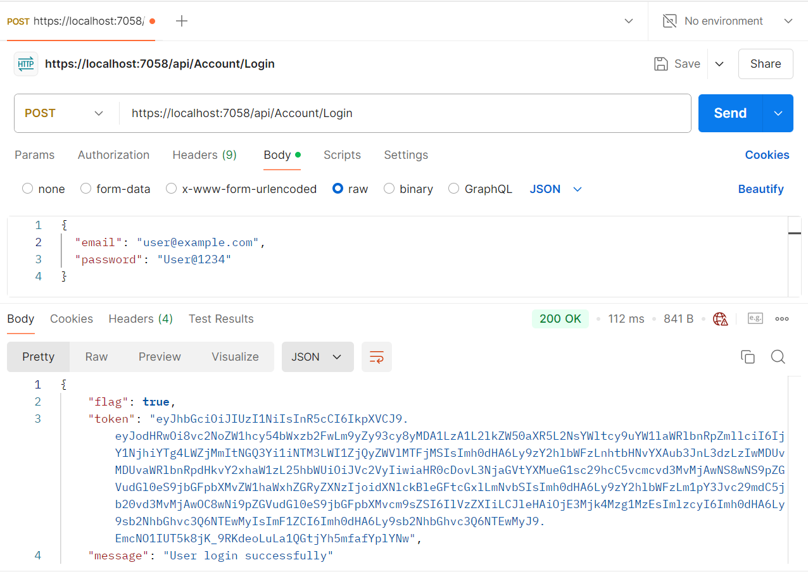

---

# JWT Authentication with ASP.NET Core Web API

This project is a JWT Bearer Token Authentication application built with ASP.NET Core Web API 8.0 (LTS). It demonstrates how to implement secure authentication using JSON Web Tokens (JWT) and can be integrated into any Core Web API project.

## Features

- ASP.NET Core 8 Web API framework (LTS)
- JWT Bearer Token Authentication
- ASP.NET Core Identity for user management
- Entity Framework Core for data access
- Swagger (Swashbuckle) for API documentation
- Token validation using `Microsoft.IdentityModel.Tokens`

## Prerequisites

- .NET Core SDK 8 (Long-Term Support)
- Visual Studio 2022 or later / Visual Studio Code
- SQL Server

## Installation

1. Clone the repository:
   
   ```bash
   git clone https://github.com/yousuf-mansur/jwt-authentication-core-web-api.git
   ```

2. Open the project in Visual Studio:
   - Open the `.sln` file in Visual Studio.

3. Restore NuGet packages (if necessary):
   - Go to **Tools > NuGet Package Manager > Package Manager Console**.
   - Run the following command to restore the packages:
     
     ```bash
     dotnet restore
     ```

4. Set up the database:
   - In the Package Manager Console, run the following command to apply the migrations and create the database:
     
     ```bash
     Update-Database
     ```

## Running the Application

1. Press `F5` or click the Start button in Visual Studio to run the application.
2. The API will open in your default web browser or the specified Swagger URL.

## Images View

Sample images for the project are located in the **Screenshots** folder.

## Taking Project
 

### Login Page
# Admin Registration
 

 # User Registration
 


# Admin Login
 

 # User Login
 

## Usage

You can now authenticate users using JWT tokens and manage secure API access. The application provides:
- Token generation upon successful login
- Token validation on protected API endpoints
- Swagger UI for easy testing and documentation

## Project Structure

- `Controllers/` - Contains the API controllers for handling requests and responses.
- `Models/` - Contains the Entity Framework Core models and Identity models.
- - `wwwroot/` - Contains static files like CSS, JavaScript, and images (if needed).

## Packages Used

The following NuGet packages are used in this project:

```xml
<PackageReference Include="Microsoft.AspNetCore.Authentication.JwtBearer" Version="8.0.10" />
<PackageReference Include="Microsoft.AspNetCore.Identity.EntityFrameworkCore" Version="8.0.10" />
<PackageReference Include="Microsoft.EntityFrameworkCore" Version="8.0.10" />
<PackageReference Include="Microsoft.EntityFrameworkCore.SqlServer" Version="8.0.10" />
<PackageReference Include="Microsoft.EntityFrameworkCore.Tools" Version="8.0.10">
  <PrivateAssets>all</PrivateAssets>
  <IncludeAssets>runtime; build; native; contentfiles; analyzers; buildtransitive</IncludeAssets>
</PackageReference>
<PackageReference Include="Microsoft.IdentityModel.Tokens" Version="8.1.2" />
<PackageReference Include="Swashbuckle.AspNetCore" Version="6.9.0" />
<PackageReference Include="Swashbuckle.AspNetCore.Filters" Version="8.0.2" />
<PackageReference Include="System.IdentityModel.Tokens.Jwt" Version="8.1.2" />
```

## Contributing

1. Fork the repository.
2. Create your feature branch (`git checkout -b feature/AmazingFeature`).
3. Commit your changes (`git commit -m 'Add some AmazingFeature'`).
4. Push to the branch (`git push origin feature/AmazingFeature`).
5. Open a pull request.

## About Me

I am Md. Yousuf Mansur, a full-stack developer specializing in web application development. My skills include:

- ASP.NET MVC and ASP.NET Core
- Angular and React for front-end development
- Entity Framework and Entity Framework Core
- SQL Server database management
- RESTful APIs and Web Services
- JWT Authentication
- JavaScript, jQuery, and Ajax

My journey in software development began in 2023 with an IsDB-BISEW scholarship. I have completed my IsDB-BISEW IT scholarship course at Star Computer Systems Limited.

With a year of experience in web development, I am proficient in modern technologies and methodologies, enabling me to develop a wide range of web applications.

- Contact me for your project
- E-mail: mansurmdyousuf@gmail.com
- WhatsApp: +880 1719983377
- LinkedIn: [Md. Yousuf Mansur](https://www.linkedin.com/in/md-yousuf-mansur/)

--- 

